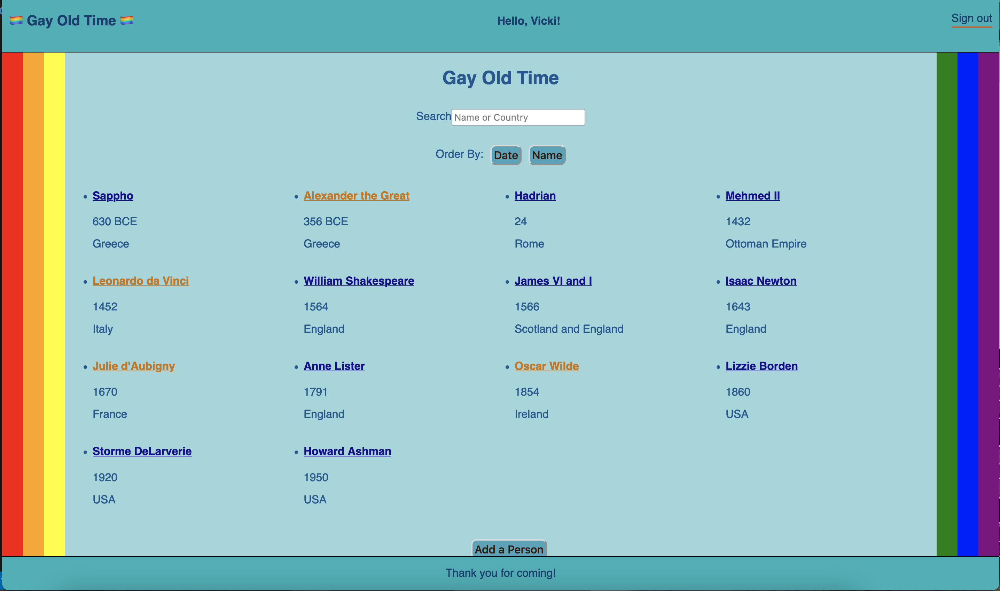

# [GayOldTime](https://gayoldtime.herokuapp.com/)

This is an app that allows people to Create, Read, Update, and Delete pages with information on various LGBT historical figures. The front page lists everyone, and can be filtered by name or country. They can be listed in chronological order (by birth year) or alphabetical (by first name). Each person's page includes their name, birthdate, deathdate, and nationality, as well as a brief biography, picture, and a list of media recommendations for additional study.

The part I'm most proud of is allowing the user to choose between sorting by date or name.

I used C#, HTML, Javascript, React, and dotnet.
